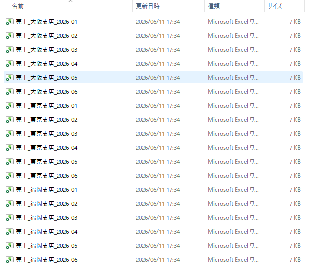
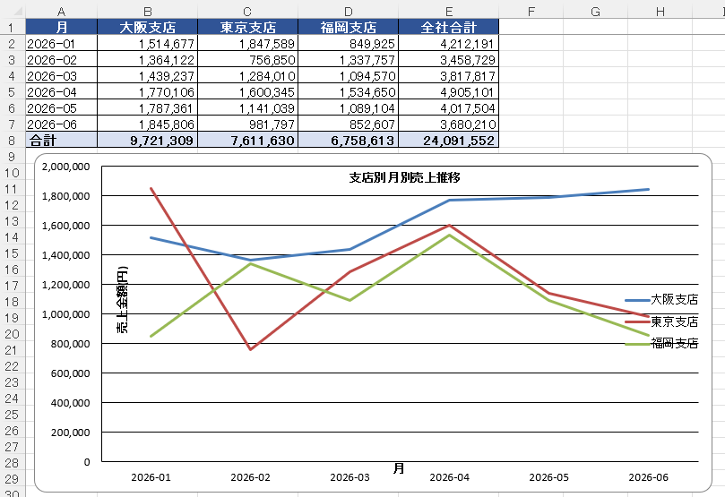
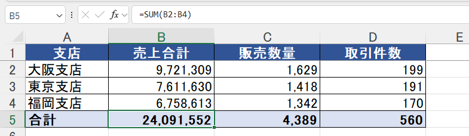

# excel-sales-report

複数の支店から毎月届くバラバラの売上Excelファイルを、ダブルクリック1回で**書式・数式・グラフ付きの集計レポート**にまとめるツールです。

手作業なら数時間かかる「ファイルを開いて→コピペして→SUMIFを組んで→体裁を整える」月次集計作業を、**実行1回・数秒**に置き換えることを想定しています。

## Before → After

**Before**: 支店別×月別に分かれた18個のExcelファイル(3支店 × 6ヶ月)



**After**: 3つの集計シート+グラフを備えた1つのレポート



| シート | 内容 |
|---|---|
| 支店別集計 | 支店ごとの売上合計・販売数量・取引件数 |
| カテゴリ別集計 | 商品カテゴリごとの集計(売上降順) |
| 月別推移 | 月×支店のクロス集計+全社合計+折れ線グラフ |

## 環境構築

````powershell
# 仮想環境の作成と有効化(Windows / PowerShell)
python -m venv .venv
.\.venv\Scripts\Activate.ps1

# 必要ライブラリのインストール(初回のみ)
pip install -r requirements.txt
````

## 使い方

````powershell
# 1. サンプルの売上データ(18ファイル)を input/ に生成
python generate_sample_data.py

# 2. 集計レポートを output/ に出力
python report.py
````

実行すると `output/売上集計レポート.xlsx` が生成されます。サンプル出力はリポジトリの [output/](output/) に同梱しています。

## 工夫した点

- **合計行を「数値」ではなく「SUM数式」で出力**: 納品後にデータを手修正しても合計が自動で再計算される、"生きたExcel" として納品します

  

- **Excelを開いたまま実行しても落ちない**: Excelがファイルを開いている間に作る一時ファイル(`~$` で始まる)を自動でスキップします
- **エラーメッセージは日本語で「次にすべきこと」まで案内**: 出力先のファイルが開かれている場合などに、英語のエラー画面ではなく「Excelでレポートを閉じてから、もう一度実行してください」と表示します
- **データ量の変化に強いグラフ**: グラフ範囲をセル番地の固定値ではなく実データから計算しているため、支店数や月数が増えてもコード修正なしで動きます
- **グラフは誤解を招かない設計**: 折れ線のスムージング(曲線補間)を無効化し、実データにない起伏が描かれないようにしています
- **日本語の列幅に対応**: 全角文字を幅2として計算する列幅自動調整で、日本語の見出しが切れないようにしています
- **再現性の確保**: サンプルデータ生成は乱数シードを固定しており、誰が実行しても同じデータ・同じレポートになります

## 動作環境

- Windows / Python 3.10以上
- pandas / openpyxl(requirements.txt参照)

## ファイル構成

````
excel-sales-report/
├── generate_sample_data.py  # サンプル売上データの生成
├── report.py                # 集計レポートの生成(本体)
├── requirements.txt         # 必要ライブラリ
├── input/                   # 入力ファイル(サンプル18件を同梱)
├── output/
│   └── 売上集計レポート.xlsx  # 出力サンプル
└── images/                  # READMEのスクリーンショット
````

## 想定している実務での利用シーン

- 各部署・各店舗から届く定型Excelの月次集計の自動化
- 集計項目・書式・グラフのカスタマイズ(列構成が異なるファイルへの対応も可能です)
````
````

**このREADMEの狙い:** 冒頭3行で「何を・どれだけ楽にするか」を言い切り、Before→Afterを画像で見せる構成です。「工夫した点」は7つ全部が今日あなたが実際に手を動かして得たもの——特に上3つは**今日エラーと格闘した副産物**です。エラーは無駄ではなく工夫点の在庫だった、というのが形になりました。最後の「想定している実務での利用シーン」は、発注者に「自分の案件に使えそう」と想像させるための一節で、提案文にもそのまま流用できます。

## 保存できたら:GitHub公開

**1. GitHub側でリポジトリ作成**
github.com にログイン → 右上の「+」→「New repository」:
- Repository name: `excel-sales-report`
- Description: `複数のExcelファイルを書式・数式・グラフ付きの集計レポートに自動でまとめるツール`
- **Public** を選択
- **「Add a README file」のチェックは入れない**(手元に既にあるため。入れると衝突して初pushが面倒になります)
- Create repository

**2. ローカルからpush**

````powershell
git add README.md
git commit -m "READMEを追加"
git remote add origin https://github.com/Hatorimai/excel-sales-report.git
git push -u origin main
````

`-u origin main` は初回だけ必要なおまじないで、「このブランチのpush先はoriginのmain」と紐付けます。2回目からは `git push` だけでOK(bookscraperと同じ状態になります)。もし `git branch -M main` をまだやっていなければ、pushの前に実行してください(前回の出力で `master` だったのを覚えていますか?その修正です)。

**3. 最終確認**
ブラウザでリポジトリを開き、(1)READMEの画像3枚が表示される、(2)Before→Afterの構成が崩れていない、(3)input/とoutput/のファイルが見える、を確認。

公開できたらURLを貼ってください。私も実際に表示を検品します。それが通れば**リポジトリ②完成**——ポートフォリオ3点のうち2点が揃い、残すはYOLOv8デモのみです。